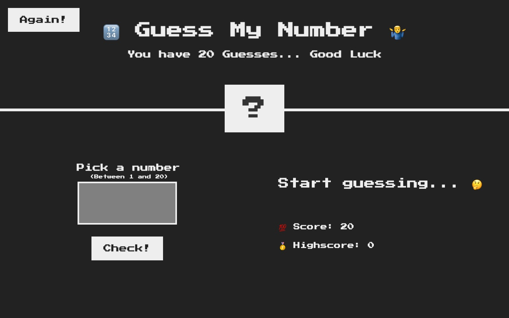

# Guess My Number

A number guessing game built with HTML, CSS and vanilla JavaScript.

## About

This is an early bootcamp assignment (Udemy JavaScript course, 4/12/2022), built when I was a very early developer, hungry to learn more.

## How to play

1. The game picks a secret number between 1 and 20.
2. Enter a guess and press **Check!** You get a higher or lower hint, and each wrong guess costs a point (you start with 20).
3. Guess correctly to win and set a high score, or run out of points and lose.
4. Press **Again!** to start a new round.

## Run it

No build step. Open `index.html` in a browser.

## Portfolio card

The block below is machine-readable project info for a portfolio site (invisible on GitHub). Keep it in sync when the project, URL or tech changes. To build a card: read this JSON and use `title`, `tagline`/`description`, `thumbnail`, `tech`, and link to `liveUrl` and `repoUrl`.

<!-- portfolio-card:start
{
  "title": "Guess My Number",
  "category": "game",
  "tagline": "A number guessing game where you find the secret number from 1 to 20 before your score runs out.",
  "description": "The game picks a random secret number between 1 and 20. Enter a guess and press Check to get a higher or lower hint, losing a point for each wrong guess. Guess correctly to win and set a high score, or press Again to start a new round.",
  "liveUrl": "https://pickanumber.margotticode.com",
  "repoUrl": "https://github.com/jgotti1/PickANumber",
  "thumbnail": "https://raw.githubusercontent.com/jgotti1/PickANumber/main/docs/preview.jpg",
  "tech": [
    "HTML",
    "CSS",
    "JavaScript"
  ],
  "features": [
    "Random secret number from 1 to 20",
    "Higher or lower hints after each guess",
    "Score countdown from 20 with in-session high score",
    "Win and lose states with a one-click restart"
  ],
  "platforms": [
    "desktop",
    "tablet",
    "mobile"
  ],
  "status": "archived",
  "origin": "Early bootcamp assignment (Udemy JavaScript course, 2022), built as a very early developer hungry to learn more"
}
portfolio-card:end -->
